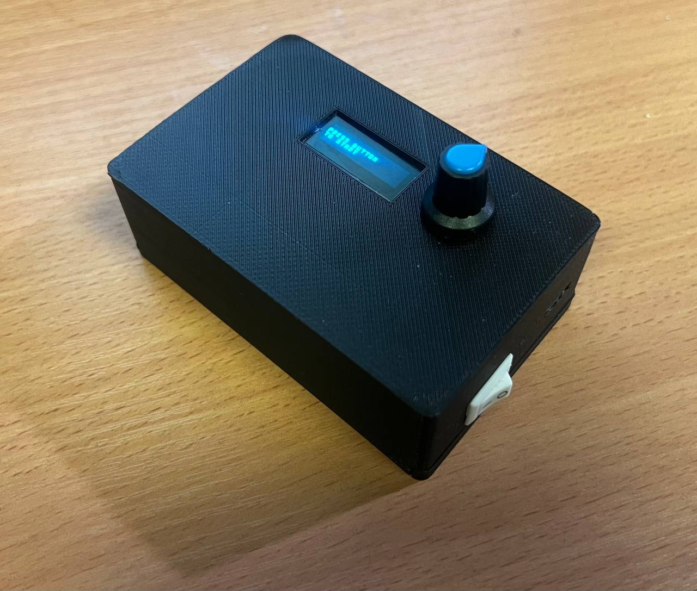
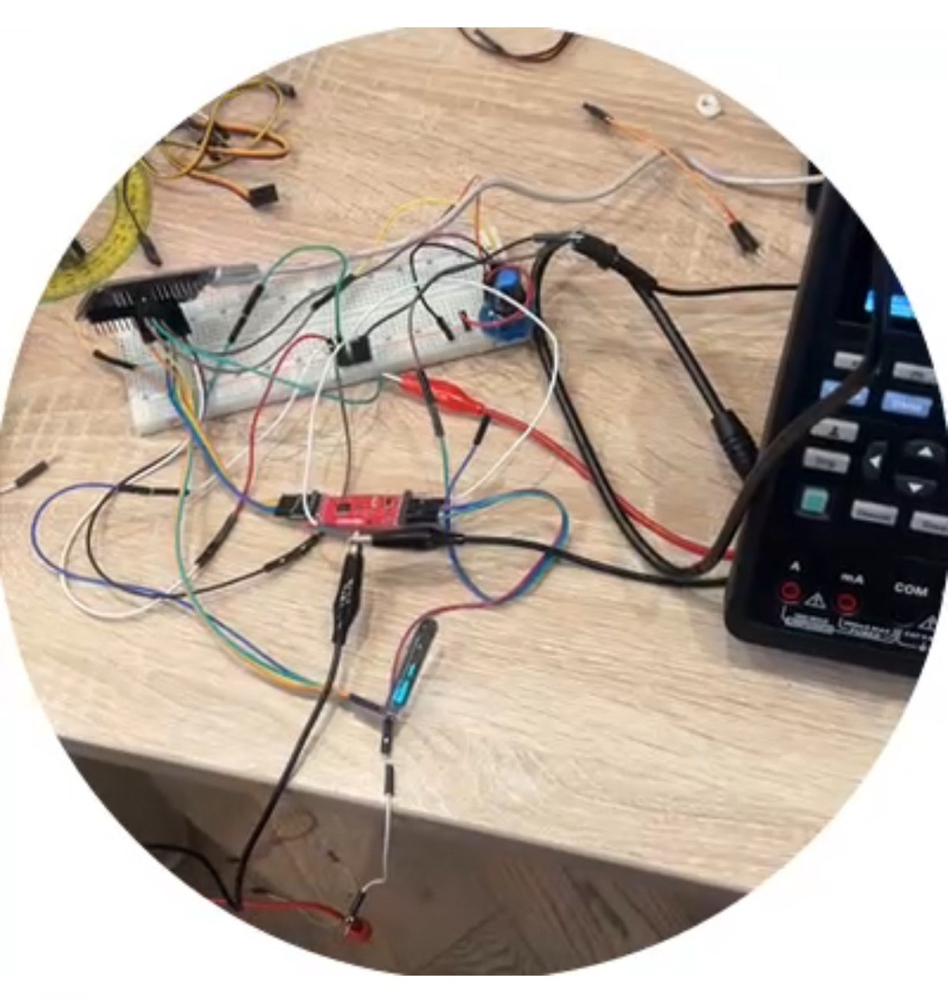

# Bluetooth Audio Transmitter  
[](LICENSE)  
[](https://docs.espressif.com/projects/esp-idf/)  
[](https://www.kicad.org/)

Портативный Bluetooth-передатчик для беспроводной передачи звука с аналоговых источников (3.5 мм) на наушники или колонки.  
**Цель проекта**: Интеграция проводных аудиоустройств в современные беспроводные экосистемы.

---

## 🚀 Особенности
- **Bluetooth A2DP**: Передача стереозвука с поддержкой кодеков SBC.
- **OLED-дисплей**: SSD1306 (32x64 пикселей) для управления и отображения:
  - Список доступных для подключения устройств.
  - Уровень громкости.
- **Энкодер EC11**: Интуитивное управление (выбор устройств, регулировка громкости).
- **Компактный дизайн**: Корпус 93x61x33 мм, напечатанный на 3D-принтере (PLA).
- **Автономность**: Работа от Li-Po аккумулятора 1050 мАч с зарядкой через USB-C.
- **Открытый исходный код**: Полная документация и файлы для самостоятельной сборки.

---

## 🔧 Технологии и компоненты
### Аппаратная часть
| Компонент               | Характеристики                          | Ссылка на Datasheet |
|-------------------------|-----------------------------------------|---------------------|
| Микроконтроллер         | ESP32-WROOM-32 (Bluetooth 4.2 + Wi-Fi)  | [ESP32-WROOM-32](./docs/esp32-wroom-32_datasheet_en.pdf) |
| АЦП                     | PCM1808 (24-bit, 96 kHz, SNR 112 dB)    | [PCM1808](./docs/pcm1808.pdf)  |
| Драйвер дисплея         | SSD1306 (I2C)                           | [SSD1306](./docs/SSD1306.pdf) |
| Стабилизатор питания    | ADP3338 (3.3V) / L78L05 (5V)            | [ADP3338](./docs/ADP3338.pdf), [L78L05](./docs/l78l-1.pdf) |
| Модуль заряда           | IP2326 (USB-C)                          | [IP2326](./docs/ip2326.pdf) |
| Энкодер                 | EC11                                    | [EC11](./docs/PEC11R.pdf) |

### Программная часть
- **Прошивка**: Написана на C с использованием ESP-IDF v4.4.
- **Библиотеки**:
  - `esp_a2dp` — Реализация Bluetooth A2DP Source (встроенная).
  - `i2s_audio` — Захват аудио с АЦП через I2S (встроенная).
  - `ssd1306` — Управление OLED-дисплеем (написана в рамках проекта).
  - `EC11` — Работа с энкодером (написана в рамках проекта).
- **Инструменты**:
  - `KiCad 7.0` — проектирование схемы и PCB.
  - `Autodesk Inventor` — 3D-моделирование корпуса.
  - `ESP-IDF` — сборка и отладка прошивки.

---

## 📦 Сборка устройства
### 1. Аппаратная часть
#### Схемы и PCB
- [Файлы KiCad](https://github.com/Iprime111/bluetooth-transmitter/tree/master/bluetooth-transmitter-pcb):  
  - Принципиальная схема.  
  - Разводка двухсторонней платы.  
  - Gerber-файлы для заказа на производстве.  

#### 3D-модель корпуса
- [STL и IPT-файлы](https://github.com/Iprime111/bluetooth-transmitter/tree/master/case-design):  
  - Корпус состоит из двух частей: верхняя крышка/корпус с отверстиями для дисплея/энкодера, нижняя — крышка на пазовом соединии.  
  - Рекомендуемые параметры печати: слой 0.2 мм, заполнение 15%.

---

### 2. Программная часть
#### Установка зависимостей
1. Установите [ESP-IDF v5.4](https://docs.espressif.com/projects/esp-idf/en/v5.4.1/esp32/get-started/).
2. Клонируйте репозиторий:
   ```bash
   git clone https://github.com/Iprime111/bluetooth-transmitter.git
   cd bluetooth-transmitter
   ```

#### Компиляция и прошивка
1. Подключите ESP32 через USB.
2. Соберите и загрузите проект:
   ```bash
   idf.py build
   idf.py -p /dev/ttyUSB0 flash
   ```

---

## 🎮 Использование
### Основные функции
1. **Подключение источника звука**:  
   Вставьте кабель 3.5 мм в разъем на корпусе.  
2. **Поиск устройств**:  
   - Включите устройство
   - Нажмите на кнопку энкодера для поиска устройств
   - Поворот энкодера → выбор устройства из списка.  
   - Нажмите энкодер для подключения.
   - При необходимости выберите пункт `RESTART DISCOVER` для повторного сканирования 
3. **Управление громкостью и проигрыванием**:  
   - Выберите пункт `PLAY/STOP` для воспроизведения или остановки аудио
   - Войдите в режим изменения громкости путем выбора соответствующего пункта меню. Поворотом энкодера установите желаемый уровень громкости. Для выхода повторно нажмите кнопку энкодера.  
   - Для отключения нажмите кнопку `BACK`.


---

## 📊 Технические характеристики
| Параметр                | Значение                     |
|-------------------------|------------------------------|
| Радиус действия         | До 15 м (в помещении)        |
| Автономность            | 8 часов (при 50% громкости)  |
| Задержка передачи       | < 200 мс                     |
| Частотный диапазон      | 20 Гц – 20 кГц               |

---

## 🔄 Сравнение с аналогами
| Параметр               | Наш проект             | UGREEN Transmitter     | Sennheiser BT-T100     |
|------------------------|------------------------|------------------------|------------------------|
| **Стоимость**          | ~$20 (DIY)             | ~$40                   | ~$100                  |
| **Размеры**            | 93x61x50 мм            | 80x50x20 мм            | 100x60x25 мм           |
| **Открытость**         | Полная                 | Нет                    | Нет                    |
| **Кастомизация**       | Да (код + корпус)      | Нет                    | Нет                    |

---

## 📁 Структура репозитория
```
bluetooth-transmitter/
├── components/           # Исходный код прошивки (ESP-IDF)
│   ├── audio-stream/     # Получение звука с PCM1808
│   ├── bluetooth-lib/    # GAP, AVRC, A2DP и управление подключениями
│   ├── dispatcher/       # Вспомогательные функции для асинхронной работы
│   ├── oled-display/     # Драйвер SSD1306
│   ├── main/             # Конфигурация устройства и пользовательский интерфейс
│   └── encoder/          # Обработка энкодера
├── bluetooth-transmitter-pcb/  # Схемы и PCB (KiCad)
├── case-design/          # 3D-модели корпуса (IPT, STL)
├── docs/                 # Документация
└── README.md             # Этот файл
```

---

## 📜 Лицензия
Проект распространяется под лицензией **MIT**.  
Полный текст доступен в файле [LICENSE](LICENSE).

---

## 👥 Команда
- **Владимир Чурсин**  
  - Разработка ПО, 3D-моделирование.  
  - ✉️ `chursin.vv@phystech.edu`  
  - [GitHub](https://github.com/Amlola)  
- **Максим Тимошкин**  
  - Схемотехника, сборка, тестирование.  
  - ✉️ `timoshkin.ma@phystech.edu`  
  - [GitHub](https://github.com/Iprime111)  

---

## 📸 Фото и демонстрация
**Фотография финальной версии устройства**



**Фотография прототипа**



**Демонстрация работы**:

<video width="480" height="640" controls>
  <source src="docs/demonstration.mp4" type="video/mp4">
</video>

---

## 🔮 Будущие улучшения
- Добавление поддержки кодеков aptX.  
- Реализация мультиподключения (2 устройства).  
- Интеграция с мобильным приложением для настройки.  

---

**🔗 Ссылка на проект**: [GitHub](https://github.com/Iprime111/bluetooth-transmitter)  
